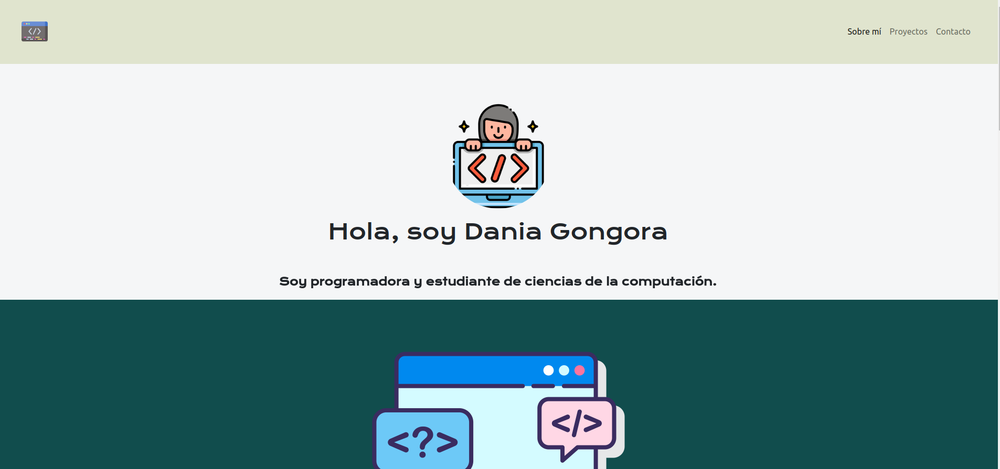

# Portafolio.

Portafolio de pagina web con más proyectos.
Para visualizar este proyecto basta con ir a daniagongora.github.io

### Características.
Este proyecto esta desarrollado utilizando:
Esta página web fue creada con:

* HTML.
* CSS.
* JavaScript.
* Framework bootstrap.
* Fuentes de Google para una mayor personalización.

### Secciones
La página web esta dividida en tres secciones:
Sobre mí: En la que hablo sobre mi formación e intereses.
Proyectos: En la que hay links directos hacia mis proyectos más relevantes en github.
Contacto: En la que redirecciona a mi github, correo electrónico y LinkedIn.

